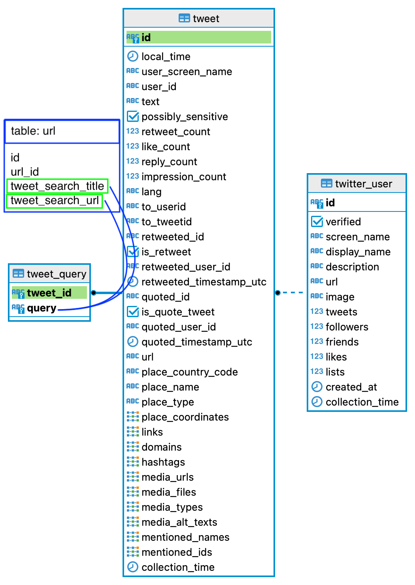

# SPSM Project Database Manager

Tools to create, update, and enrich the SPSM project's data.

---

## Information on data sources in URLs table

### - [How the original sources' data was gathered](doc/data-sources.md)

### - [How the original sources' data was aggregated by URL](doc/normalization.md)

### - Data source statistics:

- Condor
  - start: `2011-01-01 08:10:00`
  - end: `2022-07-05 21:20:00`
  - count: `98,794`
- Science Feedback
  - start: `2008-04-02T23:31:39Z` (not normalized in merged table column `date`)
  - end: `2022-12-16 03:38:15`
  - count: `1,5037`
- De Facto
  - start: `0202-07-06 23:09:21`
  - end: `2022-12-17 00:00:00`
  - count: `290`

### - [How the URLs were archived](doc/archive.md)

---

## Database

The database is being created with scripts in [src/build-database](src/build-database/), which take advantage of Python dataclasses to store static information about the tables' original schemas, as they were conceived at the creation of the database. To observe the database's creation locally, install PostgreSQL and create a database ("spsm"). Using your computer's user name (and password if necessary), run the database creation script. You will need a configuration file ([see example](example.config.json)) that details your connection to the PostgreSQL database and lists files of Twitter data you want to import.

```shell
$ python src/build-database/main.py --config config.yml
```

### URL Table


The script `src/build-database/main.py` establishes a connection to the database, creates tables, parses rows of the data files, and inserts selected Twitter data into the right table.

1. Connection to the database

- The [script](src/build-database/main.py) connects to the database by importing the object `connection` from the [`__init__.py`](src/build-database/connection/__init__.py) file in the `connection/` folder.
- From the same `__init__.py` file, the script also imports a dictionary of the data file paths, which was parsed from the configuration file.
- These objects imported from the `__init__.py` file in `connection/` are created via functions in [`connection/create_connection.py`](src/build-database/connection/create_connection.py) and [`connection/parse_args.py`](src/build-database/connection/parse_args.py).

2. Create tables

- The script creates instances of dataclasses that represent all the static and necessary information about a table's schema, including the column names, their data types, and the table's constraints. These are detailed in [`tables/schemas.py`](src/build-database/tables/schemas.py)

3. Parse data

- The script iterates through the data files parsed from the configuration file and opens each one.
- For each open file, the script iterates through the rows, reading each CSV row as a dictionary.

4. Insert data

- For each table, the script parses and cleans the CSV row using the class method `clean` that belongs to the table. This method selects information relevant to that table's data and recasts the data as the right data type for the column. In the case of data types that are arrays, the method rewrites the array so it is legible to an SQL query. `['one', 'two', 'three']` becomes `'{"one", "two", "three"}'`. The `clean` method also cleans all text data, replacing every single quotation mark with 2 single quotation marks, so that the text does not raise an error in the SQL database.
- With the data parsed and cleaned, it is inserted into the table using the table's base class method `insert_values`.

### Tweet Table to Tweet-Query Relational Table

#### Description

The `tweet` table contains every tweet collected during the course of data collection for the project. The primary key is the column `id`, which represents the Tweet's ID according to Twitter. Tweets collected by search queries are related to one another via the `tweet_query` relational table. The latter table contains every pairing of Tweet and search query. The primary key of the `tweet_query` table is the composite of the `tweet_id` and `query` fields, which ensures that the table contains only a unique set of relations between Tweets and search queries.

#### Many-to-Many Relation

In the relational `tweet_query` table, the ID of a Tweet (`tweet_id`) can occur many times if a Tweet satisifed more than one query. Likewise, the `query` can occur many times if more than one Tweet matched on the search query.

#### Data ingestion

If when inserting data to the `tweet` table the Tweet already exists in the table, a comparison is made and the prioritized Tweet's data is either conserved or used to replace the existing data.

_Note: Currently, priority is given to Tweets that were collected more recently in order to have more updated counts of user interactions with the Tweet._



### Tweet Table to User Table

#### Description

The `tweet` table also relates to the table `twitter_user`. The latter's primary key is the column `id`, which relates to the Twitter user's ID according to Twitter.

### Many-to-Many Relation

_Note: At the moment (late June 2023), only the Tweet's author (`user_id`) is related to the Twitter users in the `twitter_user` table. The data is derived from the author of a Tweet and therefore there is a primary-key relationship between `twitter_user.id` and `tweet.user_id`. This should be changed, however, so that the `twitter_user` table contains the ID of all Twitter users in the database's tweets, including those mentioned and those who authored a tweet that another tweet quoted._

#### Data Ingestion

If when inserting data to the `twitter_user` table the Twitter user already exists in the table, a comparison is made and the prioritized user's data is either conserved or used to replace the existing data.

_Note: Currently, because Twitter users are only added to the `twitter_user` table if they authored a Tweet in the database, priority is based on the recency of the Tweet that the user authored. The idea behind this prioritization is to have a more up-to-date version of the Twitter user's profile. However, an argument for prioritizing data from the user's oldest Tweet in the database could be made as well._


