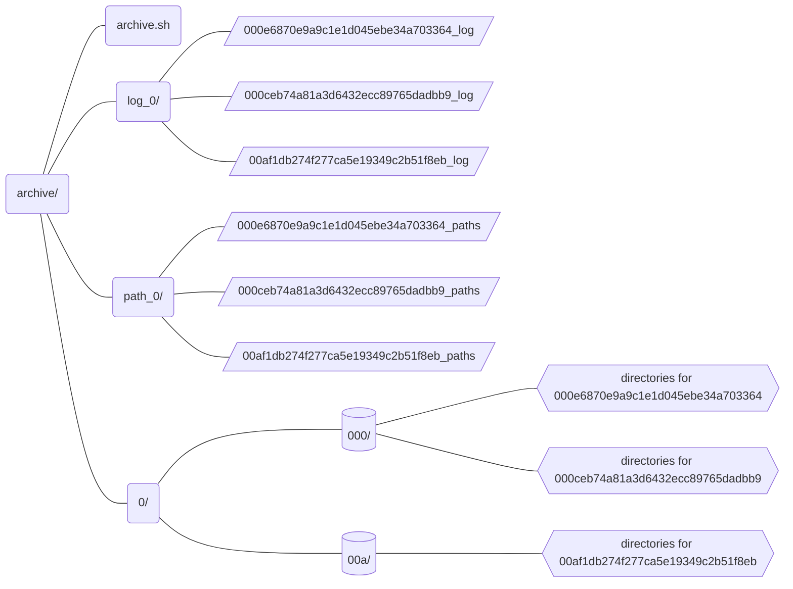

# Collection 1: Misinformation Sources

## Merge Data

Merge data from the 3 data sources into one meta table, which aggregates data by URL.

 ```shell
 $ python merge.py --dataset [condor|science|defacto] --filepath PATH/TO/DATA.csv --length INTEGER --merged-table PATH/TO/EXISTING/MERGED-TABLE.csv
 ```
### options
1. `--dataset` [required] : `condor`, `science`, or `defacto`
2. `--filepath` [required] : path to the data you wish to merge into the table
3. `--length` [optional] : length of the data file (if provided, it allows for a loading bar)
4. `--merged-table` [optional] : path to the merged table you wish to update

The merged table preserves every column from the incoming dataset (see Supporting Datasets below) and aggregates data by the URL's normalization.

Cases
- If two or more datasets contain the same URL, their data is written to the same row and in the dataset's dedicated columns.

    |url_id|sources|normalized_url|...|condor_url_rid|...|science_url|...|
    |--|--|--|--|--|--|--|--|
    |4c1c97346dd51aa32218c81bf2df45d6|science\|condor|rumble.com/v1q3s40-died-suddenly-official-trailer-streaming-november-21st.html|...|https://rumble.com/v1q3s40-died-suddenly-official-trailer-streaming-november-21st|...|https://rumble.com/v1q3s40-died-suddenly-official-trailer-streaming-november-21st.html|

- If a dataset registers a URL under multiple IDs (i.e. Science Feedback reports multiple appearances of the same URL), the data is aggregated in one row.

    |url_id|sources|...|science_id|science_urlContentId|...|
    |--|--|--|--|--|--|
    |d647d2b6e990e637db472c6262cbd7b7|science|...|TL74M\|TL74K|T9744\|T9744|

## Archive Web Pages

- Download web pages' content and send the pages to be archived at the Internet Archive; record the log and paths of downloaded files.

from the subdirectory `archive/`
```shell
$ bash archive.sh PATH/TO/MERGED-TABLE.csv
```

Result:



### TODO (in Python)
   1. list all log subdirectories in archive directory (see Python's native [os library](https://docs.python.org/fr/3/library/os.html))
       - iterate through all log subdirectories and all `wget` logs inside each subdirectory
   2. with a `wget` log open,
       - parse URL ID from log file name
       - on first line, parse log date-time (ex. `--2022-12-23 09:46:32--`)
       - on last line, parse success
           - fail: `Liens convertis dans 0 fichiers en 0 secondes.`
           - success: `Liens convertis dans 7 fichiers en 0,004 secondes.`
       - if `wget` download was successful, index date-time to URL ID
       ```python
       index = {
           "000ceb74a81a3d6432ecc89765dadbb9": "2022-12-23 06:37:55", # successful
           "000e6870e9a9c1e1d045ebe34a703364": None, # unsuccessful
       }
       ```
   4. with merged table open,
       - iterate through merged table while adding a value to `archive_timestamp` column

