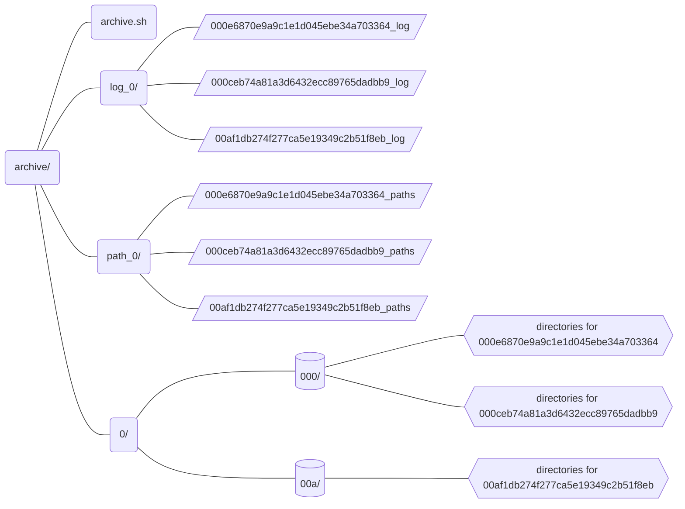

## Archive Web Pages

- Download web pages' content and send the pages to be archived at the Internet Archive; record the log and paths of downloaded files.

from the subdirectory `archive/`

```shell
$ bash archive.sh PATH/TO/MERGED-TABLE.csv
```

Result:


