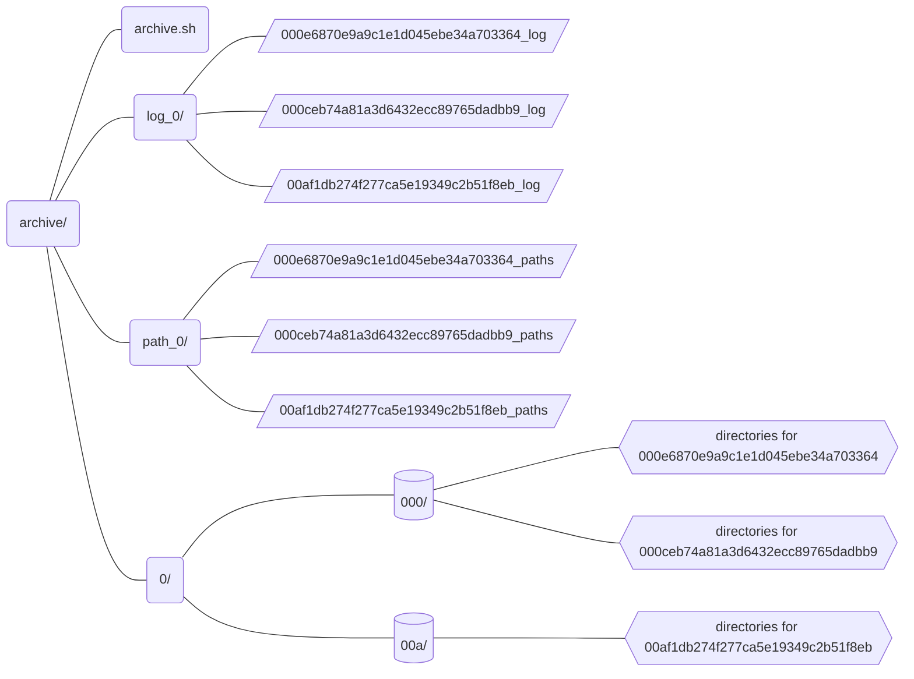

## Archive Web Pages

Working from a dataset of aggregated URLs, the script [`archive.py`](../src/archive/archive.py) loops through every URL and performs 2 tasks.

1. It sends the URL to the Internet Archive to be archived.
2. It downloads the page and those of its dependent filepaths.

The URL that is actually archived is not the URL's normalization because the normalization lacks a protocol. Instead, the archiving is done using the URL in the column `archive_url`, which may or may not be slighly different than other URLs aggregated under the same URL normalization.

Archiving produces a local archive with a file based on the archive URL's `url_id` (hash of its normalization). In general, 3 types of directories are created.

1. `log_[0-9|A-Z]` : directory in which to store the log file produced by the `wget` archiving command
2. `path_[0-9|A-Z]` : directory in which to store the text file the script writes containing paths to all the files created during the archiving of a URL
3. `[0-9|A-Z]` : directory in which to store a subdirectory that will store all the directories and files created during the archiving process

Each of these top-level directories contains a single character that represents the first in the archived URL's `url_id`. This limits how many URLs are archived within one directory. Limiting the number of URLs archived in one directory is important because a file system can only handle so many subdirectories inside one directory, and the archiving process generates many files and subdirectories for each processed URL.

An example of this file structure is demonstrated below using the examples of 3 URLs, all of whose `url_id` begins with the character `0`.

