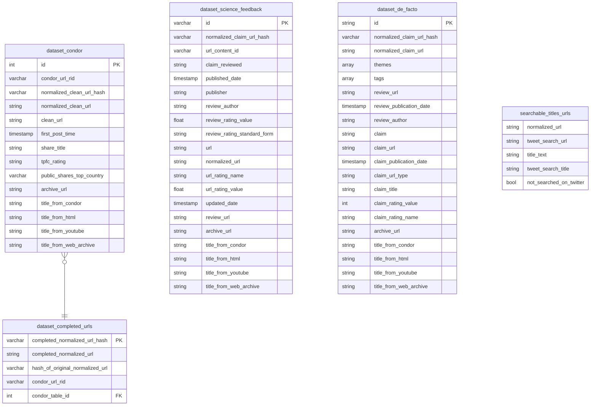
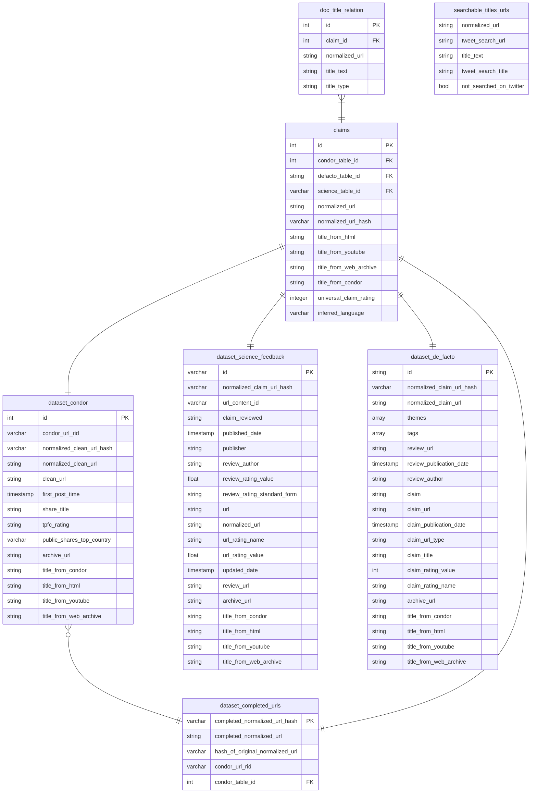

# Database

The database is built with scripts in this directory. To observe the database's creation locally, install PostgreSQL and create a database ("spsm"). You will need to modify the [example configuration YAML](example.config.yml) so that it has details about your connection to the PostgreSQL database as well as paths to all the files necessary for data ingestion, which are listed in the example configuration YAML and detailed below.

Steps:

1. [Installation and set up](#set-up)
1. [Ingest original data sources into database](#step-1-ingest-original-data-sources)
1. [Merge data sources into central claims table](#step-2-merge-data-sources)
1. [Ingest Tweet data from CSV files](#step-3-ingest-tweet-data)

## Step 1. Ingest original data sources

```
Usage: ingest.py [OPTIONS] CONFIG

  Main function to manage the ingestion of raw data to the database. Data can
  come from CSV files or JSON files. Paths to these files must be declared in
  the configuration YAML, which is this command's first and only positional
  argument.

Options:
  --data-source [condor|de facto|science feedback|completed urls|searchable titles and urls]
  --no-prompt                     Skip the prompt that asks the user to
                                  double-check the path to the data file.
  --help                          Show this message and exit.
```

### Configuration YAML

The configuration YAML has 2 top-level keys, `connection` and `data sources`. The first contains information necessary for Python to connect to the PostgreSQL server. The second provides paths to the files whose data will be transformed and used to construct the database's tables. These file paths are recorded in the configuration YAML because the data files upon which the database is built should never be altered. In our case, each file necessary for the data ingestion phase is stored in a private repository, whose links are given below (and accessible only to group members).

- `condor`: [Link to CSV](https://github.com/medialab/spsm-data/blob/main/database-files/for_import/condor_full.csv) (rows: 101422)
  - data delivered in summer 2022
- `science feedback`: [Link to JSON](https://github.com/medialab/spsm-data/blob/main/database-files/for_import/science_feedback_full.json)
  - data collected from API in fall 2022, re-requested in spring 2023
- `de facto`: [Link to JSON](https://github.com/medialab/spsm-data/blob/main/database-files/for_import/defacto_full.json)
  - data collected from API in fall 2022, re-requested in spring 2023
- `enriched titles`: [Link to CSV](https://github.com/medialab/spsm-data/blob/main/database-files/for_import/url_title_enrichment.csv) (rows: 110166)
  - all data sources' URLs, normalized and de-duplicated
  - each normalized URL is associated with (a) a non-normalized version used for achiving, `archive_url`, and (b) titles:
    - `condor_share_title`: provided by Condor dataset
    - `yt_video_headline`: requested from YouTube API
    - `webpage_title`: scraped from HTML
    - `webarchive_search_title`: recovered from Web Archive
- `completed urls`: [Link to CSV](https://github.com/medialab/spsm-data/blob/main/database-files/for_import/unique_completed_urls_from_condor_set_of_duplicate_urls.csv) (rows: 612)

  - URLs manually constructed from impoverished URLs
  - accompanying metadata (i.e. `condor_id`) is from Condor because impoverished URLs were selected from Condor dataset

- `searchable titles and urls`: [Link to CSV](https://github.com/medialab/spsm-data/blob/main/database-files/for_import/searchable_urls_and_titles_tweet_search.csv) (rows: 169465)
  - dataset that relates a claim's title or URL with (i) a searchable version and (ii) a value indicating whether or not a search was attempted

### Ingestion commands

- Ingest Condor data

  - `python ingest.py --data-source condor`
  - necessary files (YAML): `condor`, `enriched titles`
  - yields tables "dataset_condor", "dataset_enriched_titles"

- Ingest De Facto data

  - `python ingest.py --data-source "de facto"`
  - necessary files (YAML): `de facto`, `enriched titles`
  - yields tables "dataset_de_facto", "dataset_enriched_titles"

- Ingest Science Feedback data

  - `python ingest.py --data-source "science feedback"`
  - necessary files (YAML): `science feedback`, `enriched titles`
  - yields tables "dataset_science_feedback", "dataset_enriched_titles"

- Ingest manually completed URLs dataset

  - `python ingest.py --data-source "completed urls"`
  - necessary files (YAML): `completed urls`
  - necessary tables: "dataset_condor"
  - yields table "dataset_completed_urls"

- Ingest dataset searchable titles and URLs
  - `python ingest.py --data-source "searchable titles and urls"`
  - necessary files (YAML): `searchable_urls_and_titles_tweet_search.csv`
  - yields table "searchable_titles_urls"

### Result at the end of data source ingestion



## Step 2. Merge data sources

### Usage

```
Usage: merge_sources.py [OPTIONS] CONFIG

  Main function to manage the merging of all the datasets into a central
  claims table and then to explode those claims into a relational table that
  records each assoction between a document (URL) and a title attributed to
  that document. A document in the claims table could have a title from
  Condor, YouTube, its HTML, or Web Archive.

  As its first and only positional argument, this command requires the path to
  a configuration YAML which contains details about the PostgreSQL connection.

Options:
  --help  Show this message and exit.
```

### Result of merge



## Step 3. Ingest Tweet data

While reading through a list of paths to CSV files containing collected Tweets, import each Tweet to the database.

### Usage

```
Usage: tweets.py import [OPTIONS] FILEPATH_LIST

  Main function to manage the ingestion of Tweets to the database.

Options:
  --config TEXT
  --reset        FOR TESTING ONLY: Drop existing tables
  --help         Show this message and exit.
```

In addition to a path to the configuration YAML, given as the option `--config`, the command `tweets.py import` requires a path to a text file (`.txt`) in which every new line is the path to a data file.

The `FILEPATH_LIST.txt` file can be generated using a combination of the bash commands `echo` and `>`, and while taking advantage of the auto-completion of file paths.

In example:

```
echo ../../data/tweets/collection1.csv >> FILEPATH_LIST.txt
```

As such, the Python script parses `FILEPATH_LIST.txt` and opens the CSV file whose path is written on the line. The path must be legible to the Python script given the location from which the script is run.

## Step 4. Directly relate Tweets to Claims

### Usage

```
Usage: tweets.py relation [OPTIONS]

  Main function to streamline queries of Tweets and claims.

Options:
  --config TEXT
  --help         Show this message and exit.
```

### Result of Tweet ingestion & relation of Tweets to Claims


## Set Up

Set up the Python environment.

1. Install Python version 3.11
2. Create and activate a virtual environment.
3. Install dependencies. `pip install -r sql-requirements.txt`

Set up the connection to a PostgreSQL server and create a database. Record details of this connection and the database's name in the [configuration file](example.config.yml). See [documentation](docs/how-to-setup-postgres-server.md).
